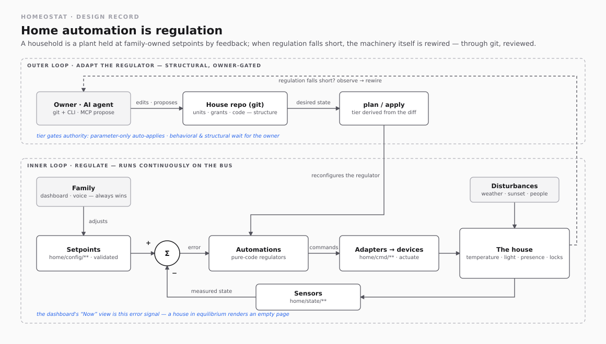
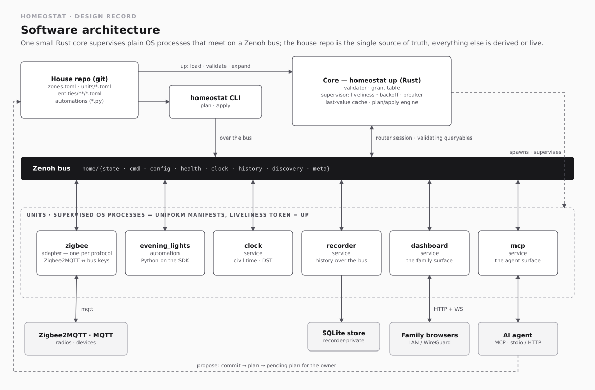
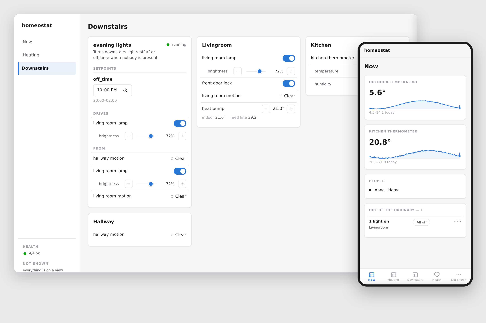

<p></p>

# Homeostat

Homeostat is home automation configured as text. The whole configuration
of a house lives in a git repo. A small Rust core runs each device adapter
and automation as a plain OS process, and they talk over a
[Zenoh](https://zenoh.io/) bus. Changes to the house go through
`homeostat plan` and `homeostat apply`, whether you make them by hand or an
AI agent proposes them.

The name comes from W. Ross Ashby's 1948 machine. The idea is the same: the
system keeps the house at its setpoints, the family adjusts those setpoints,
and the owner changes how the system works.
[docs/design.md](docs/design.md) is the full design record.



## Why

I wrote Homeostat to replace Home Assistant in my own house. It is built
on a few choices:

- The repo is the only source of truth. Nothing is configured through a
  UI. What the house should be is text in git, what it is gets read live
  from the bus, and there is no separate state file to drift.
- Automations are Python scripts on a small SDK, with no YAML language to
  outgrow. A unit can only use the bus keys its manifest declares.
- Changes are reviewed before they run. `homeostat plan` shows what would
  change and works out from the diff how disruptive it is: parameter-only,
  behavioral or structural. `homeostat apply` then rolls the change out one
  unit at a time and stops at the first failure. To roll back, check out
  the old commit and apply again.
- An AI agent can help. The MCP server lets an agent read state, history,
  logs and the audit trail, and look up the rules a manifest must follow.
  To change anything, the agent edits the repo and runs `plan`, and you
  apply it, the same as for any other change.
- Everything that runs is a supervised OS process. The core restarts a
  crashed unit with exponential backoff and gives up after five quick
  exits in a row, until an apply or a supervisor restart starts it fresh.
  All of this is reported on the bus. The model is Erlang's
  supervisor trees rather than containers or plugins.

It is early software (see [Status](#status)) and supports the devices I
have: Zigbee2MQTT, ESPHome and plain MQTT, plus the adapters listed under
Status. There is no Home Assistant bridge.

## How it works

A **house repo** declares everything about your home:

```
house/
  zones.toml              # named sets of rooms; zones never appear in keys
  dashboard.toml          # the family surface's views, as text (optional)
  units/
    zigbee.toml           # adapter: discovery endpoint, templated keys, entities dir
    evening_lights.toml   # automation: subscribes, publishes, params
    recorder.toml         # service
  entities/
    zigbee/
      kitchen_ceiling.toml   # one file per device; file stem = entity name
```

An entity file sets the device's write policy (`shared`, `exclusive` or
`arbitrated`) and its `room`; nothing else does. `examples/house/` is a
complete, commented example.

`homeostat up` validates the repo, then runs every unit as a supervised
process, all talking over a well-defined key space on the bus:

```
home/state/{room}/{entity}/{aspect}   live device state
home/cmd/{room}/{entity}/{aspect}     commands toward devices
home/config/{unit}/{param}            live-editable setpoints
home/health/{unit}                    supervision status, health events
home/history/**                       recorded history, served over the bus
```

Who can change what follows the plan tiers. Parameters can be changed
live on the bus, within the limits each manifest sets, and the dashboard
lets the family edit the ones marked as theirs. Units, grants and code
change only through the repo and plan/apply.



Both diagrams are generated by
[`docs/diagrams/generate.py`](docs/diagrams/generate.py). The SVGs embed
their draw.io model, so you can also open and edit them in
[diagrams.net](https://app.diagrams.net/).

## Quick start

**Try the demo.** The Codespaces button starts the
[starter house](examples/starter-house/) against simulated devices and
opens its dashboard, with nothing to install:

[](https://codespaces.new/freol35241/homeostat?devcontainer_path=.devcontainer/demo/devcontainer.json)

With Docker on your own machine, run `examples/starter-house/demo/up.sh`
and open http://localhost:8600
([what is simulated](examples/starter-house/demo/README.md)). A static copy
of the dashboard is also at
[freol35241.github.io/homeostat](https://freol35241.github.io/homeostat/).

To build it yourself, you need a Rust toolchain, and
[uv](https://docs.astral.sh/uv/) to run the Python units.

**Plan a house** (offline, against the empty world):

```
git clone https://github.com/freol35241/homeostat && cd homeostat
cargo run -- plan examples/house
```

On a valid repo this prints every unit to create, the expanded key space
and the grant table. On an invalid repo it prints every error and exits
non-zero, so the same command works as a house repo's CI check:

```
Homeostat plan
  repo:  examples/house
  world: empty

Units to create (4):

+ adapter zigbee (units/zigbee.toml)
    ...
+ automation evening_lights (units/evening_lights.toml)
    params:
      off_time  type=time  default=23:00  constraint={after=20:00, before=02:00}  editable_by=family

Grant table:

  evening_lights.lights  capability=light  priority=automation
    -> kitchen_ceiling  (room=kitchen, write=shared, owner=zigbee)
    ...

Plan tier: structural (4 units created, 1 grant added)
```

**Run a live house.** The integration-test fixtures work as small demos.
This one runs a clock, an adapter that echoes commands back as state, and
the `evening_lights` automation:

```
cargo build
PATH="$PWD/target/debug:$PATH" cargo run -- up tests/fixtures/house_evening
```

The `PATH` prefix is only needed for fixtures, whose adapters are test
binaries built by this crate. A real house uses commands like
`uv run units/...`.

The supervisor listens on `tcp/127.0.0.1:7447` (change it with
`--listen`), starts each unit and logs its health as it goes from
`starting` to `running`. Any Zenoh client can now watch `home/state/**`,
send commands or change a setpoint. For example, a GET on
`home/config/evening_lights/off_time` with the payload `"21:30"` changes
the running automation from the next minute. The payload `"03:00"` is
outside the manifest's constraint, so it is refused and the old value
stays.

**Change it with plan/apply.** With the house running, edit the repo and
let `plan` work out what the edit means:

```
PATH="$PWD/target/debug:$PATH" target/debug/homeostat up tests/fixtures/house_apply &
target/debug/homeostat plan tests/fixtures/house_apply --bus tcp/127.0.0.1:7447
# -> No changes. The world matches the repo.
sed -i 's/default = 1/default = 5/' tests/fixtures/house_apply/units/probe.toml
target/debug/homeostat apply tests/fixtures/house_apply --bus tcp/127.0.0.1:7447
# -> Plan tier: parameter-only (1 parameter change) ... Applied.
```

The running unit picks up the new value without a restart. If you edit
`probe.py` instead, the plan is behavioral and apply restarts that one
unit.

**Run with Docker.** Each release publishes prebuilt binaries and a
container image for linux/amd64 and linux/arm64. The image has what a
deployed house needs: the `homeostat` binary, git, uv and Python.

```
docker run -d --name homeostat \
  -v /path/to/house:/house \
  -v homeostat-uv:/var/cache/uv \
  ghcr.io/freol35241/homeostat
```

The default command is `up /house --listen tcp/0.0.0.0:7447`. Don't
publish port 7447: anything that can reach the bus has full control of the
house. Publishing it on `127.0.0.1` doesn't help either, because any
container with `network_mode: host` shares the host's loopback. Run the
other subcommands inside the container instead, where `HOMEOSTAT_BUS`
already points at the supervisor:

```
docker exec homeostat homeostat plan /house
```

The container runs as uid 1000. If another user owns your house
checkout, add `--user "$(id -u):$(id -g)"` so units can write to it. The
uv cache volume is optional; it keeps unit environments when the container
is replaced.

[`examples/starter-house`](examples/starter-house/) is a house you can
copy and make your own. It has a clock, the recorder, the Zigbee2MQTT
adapter and the evening-lights automation, and a compose file for
mosquitto, zigbee2mqtt and homeostat together.

**Run without Docker.** The starter house assumes the image, and it is
the easier route. On a small single-board computer where a container
runtime is too heavy, the release tarball runs directly on the host. You
need git and uv on `PATH`, and the release's SDK wheel in a directory uv
knows about, because the units pin `homeostat==X.Y.Z` and the SDK is not on
any package index:

```
UV_FIND_LINKS=/opt/homeostat-wheels homeostat up /path/to/house
```

Under systemd, set `KillMode=mixed` so that SIGTERM goes only to the
supervisor, which then stops its units. Set
`HOMEOSTAT_BUS=tcp/127.0.0.1:7447` in the shell you run `plan` and `apply`
from.

## The pieces

### Adapters: devices onto the bus

`adapters/zigbee2mqtt.py` is the reference adapter. It splits each
Zigbee2MQTT state message into one key per aspect and translates commands
back:

```
zigbee2mqtt/lamp_kitchen_1  {"state":"ON","brightness":128}
  -> home/state/kitchen/kitchen_lamp/on          true
  -> home/state/kitchen/kitchen_lamp/brightness  128

home/cmd/kitchen/kitchen_lamp/on  true
  -> zigbee2mqtt/lamp_kitchen_1/set  {"state":"ON"}
```

Messages from unknown devices, and malformed payloads, are dropped and
reported as a health event on `home/health/{unit}/event`; the adapter keeps
running. [docs/adapters.md](docs/adapters.md) is the full adapter contract,
with the reasoning behind each rule.

An adapter that can list its devices also publishes a discovery document on
`home/discovery/{unit}`. It lists every paired device with its binding id,
whether an entity file already claims it, and a suggested capability. An
agent uses it to write entity files for new devices
([design record: Discovery](docs/design.md#discovery)).

### Automations

Automations are Python scripts built on the SDK in `sdk/python/`. A unit
declares the SDK in its PEP 723 header, pinned to the release the house
runs:

```python
# /// script
# requires-python = ">=3.11"
# dependencies = ["homeostat==X.Y.Z"]
# ///
```

The container image includes that release's SDK wheel, so the pin
resolves without network access. The pin is part of the script, and plan
hashes the script, so an SDK upgrade shows up as a behavioral change:
`plan` lists it and `apply` restarts the units whose pin changed. Units in
this repo use a relative `path` source instead, so the tests run against
the working-tree SDK.

The automation context only exposes what the unit's manifest declares:

```python
from homeostat import automation

ctx = automation.context()              # reads units/{HOMEOSTAT_UNIT}.toml
ctx.subscribe("presence", on_presence)  # binding names from [bus.subscribes]
ctx.subscribe("clock", on_clock)
ctx.params.off_time                     # typed (datetime.time), live-updated
ctx.publish("lights", False, room="livingroom", entity="lamp")
ctx.ready(); ctx.run()                  # liveliness token, block until SIGTERM
```

Parameters live at `home/config/{unit}/{param}`. They start at the
manifest default, every write is checked against the constraint (min/max,
an after/before time window that may span midnight, or an enum), and
running units see new values without a restart. A live edit lasts until
the next apply; to keep it, commit it as the new default. A `clock`
service publishes local time on `home/clock/minute` and
`home/clock/date`.

### The recorder

`adapters/recorder.py` stores state and commands in SQLite as typed
samples. A series is keyed by entity, with the room as a tag, so a device
that moves to another room keeps one series. It also keeps an audit trail
of health events and accepted config edits. Everything reads history over
the bus, so the store stays private to the recorder and could be
replaced:

```
zenoh get 'home/history/state/lamp/on?from=2026-07-01T00:00:00+02:00;limit=100'
```

If the database can't be written (a full disk, a failing SD card), the
recorder buffers samples in memory with their original timestamps, reports
the problem as health events, and writes the buffer out once it recovers.
See [History and the recorder](docs/design.md#history-and-the-recorder).

To find out what is filling the store, `scripts/store_profile.py` reads
`home/history/stats` and ranks entities by rows and series by write rate.
The image includes it, already pointed at the house's bus:

```
docker exec <container> uv run /opt/homeostat/store_profile.py
```

### Plan / apply

`homeostat plan --bus <endpoint>` asks the running core for the live
state and diffs it against the repo. The plan's tier comes from the diff:

- parameter-only: only setpoints differ. Applying restarts nothing.
- behavioral: a unit's manifest or code changed. Applying restarts that
  unit.
- structural: units are created or removed, or the grant table changes.
  The plan shows the grant diff.

`homeostat apply` has the supervisor work through the changes one unit at
a time, in grant order, waiting for each unit to report healthy. On a
failure it stops and prints where; running it again plans only what is
left. `plan --save` writes the plan to a file you can review on a phone.
The file is invalid once the repo changes.

### The agent surface: MCP

`homeostat mcp` serves the tools `read_state`, `read_history`,
`read_logs`, `read_events`, `explain` and `schema`, over stdio or, in a
deployed house, over HTTP as a supervised service. It is read-only and only
talks to the bus, so it needs no access to the house repo. An agent changes
the house the same way you do: it edits the repo and runs `homeostat plan`,
and you apply. The [design record](docs/design.md#agent-surface-mcp)
explains why there are no write tools.

When a plan is refused, each error has a code and the rule behind it.
`explain` (or `homeostat explain <code>`) returns the same text on demand,
so an agent can look up a rule without reading the validator. `schema` (or
`homeostat schema`) returns the manifest format as JSON Schema, generated
from the parser. [docs/manifest.md](docs/manifest.md) is the same schema as
a readable page, and a test keeps it current.

### The dashboard

The dashboard is the family's view of the house. It is a supervised unit,
`adapters/dashboard.py`, serving one page and its assets with no build step.
Everything on it is generated from the house's text.

`dashboard.toml` lists the views. Each view is a set of widgets over things
the house already has: a reading as a tile, a room card, a unit card, a
chart, the people on a map, or the list of deviations.
[docs/widgets.md](docs/widgets.md) shows each widget, and every view can
show the text it was built from.

Without a `dashboard.toml`, three generated views are used:

- Now lists what is out of the ordinary: unhealthy units, lights left on,
  setpoints away from their defaults. When everything is normal it is
  empty.
- Setpoints lists every parameter the family may edit.
- Rooms shows the house room by room.

Two pages sit outside the views and are always there: Health, and Not
shown, which lists everything no view places. Clicking an item opens its
history, state or health.

Commands from the dashboard are sent at the manual priority band, so the
family's choice wins over automations. A control shows what it asked for
until the device confirms, then the outcome. Parameter edits go through the
core, which checks them against the manifest. Nothing structural can be
changed from a browser. There are no accounts: the dashboard is meant to be
reached only on the LAN or over WireGuard (see
[Security model](docs/design.md#security-model)). More in
[the design record](docs/design.md#dashboard).



## Status

Pre-1.0. What works today: the validator, `homeostat plan` and `apply`,
the supervisor, the Python SDK, the recorder (history, forecasts and
archives), the arbiter, the dashboard and the read-only MCP server.
There are adapters for Zigbee2MQTT, ESPHome, OwnTracks, an IVT490 heat
pump, Aduro pellet burners, ONVIF cameras through go2rtc, OpenWrt routers,
433 MHz transmitters and ntfy notifications. Voice control is planned
([design record](docs/design.md#voice)).

## Development

CI runs these, in this order. The devcontainer has everything they need:
`mosquitto`, `uv`, `node`, and a browser from
`scripts/install_browser.sh`.

```
cargo fmt --check
cargo clippy --all-targets -- -D warnings
cargo test
uv run --no-project --with-editable sdk/python --with 'paho-mqtt>=2,<3' python -m unittest discover sdk/python/tests
uv run --no-project --with-editable sdk/python --with 'paho-mqtt>=2,<3' --with pyright==1.1.414 pyright sdk/python/homeostat
uv run --no-project --with-editable sdk/python --with 'paho-mqtt>=2,<3' python -m unittest discover tests/adapters
uvx ruff@0.16.7 check adapters sdk scripts tests/adapters tests/browser
node --test tests/js/*.test.js
scripts/sync_starter.sh --check
uv run --script tests/browser/run.py
```

If you are writing a unit, [docs/manifest.md](docs/manifest.md) describes
every manifest field, `homeostat explain` gives the validator's rules, and
[docs/adapters.md](docs/adapters.md) is the adapter contract.

The integration tests run the real binary against a live supervisor, a
real mosquitto broker on a free port, a real SQLite store, and fake device
servers that speak each device's protocol. Each adapter has its own suite
in `tests/<adapter>.rs`. `tests/corpus/invalid/` pairs broken houses with
the exact list of errors each should produce, and `tests/browser/` runs
the dashboard in a real browser against canned data. CI also builds the
container image and runs `scripts/smoke_image.sh`, `smoke_starter.sh` and
`smoke_demo.sh` against it, and `scripts/smoke_bare.sh` checks the binary
and SDK wheel on a host without Docker.

To cut a release, run `scripts/release.sh X.Y.Z` on a clean tree. It bumps
the version everywhere, relocks the unit scripts and regenerates the starter
house. Commit that and merge it. Then either push a `vX.Y.Z` tag on the
merge commit, or publish a release with that tag on github.com. Either way
the tag builds the binaries, the wheel and the image, and attaches them to
the release.

## License

[Apache-2.0](LICENSE)
