# Dashboard widgets

<!-- Generated by scripts/widget_gallery.py; edit that, not this. -->

The words for saying how the dashboard should look. A view in
`dashboard.toml` is a list of widgets, and each widget places something
the house already has; the dashboard draws it. These are all of them,
drawn from the browser tests' fixture house. Every field each one takes
is in [manifest.md](manifest.md#widgetspec), and the dashboard shows
the text behind any view (its **Text** button).

A request in these words — "on the heating view, put a `dial` for the
heat pump in a `group` with a 24-hour `chart` of the living-room
temperature" — maps onto the file one widget at a time.

## `tile`

A signal tile per reading of an entity: the value big, today's range under it.

```toml
{ kind = "tile", entity = "spot" }
```

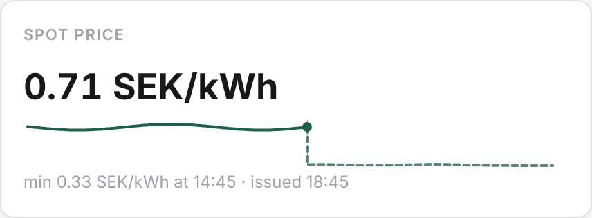

## `chart`

One aspect's history over a window.

```toml
{ kind = "chart", entity = "livingroom_temp", aspect = "temperature", hours = 24 }
```

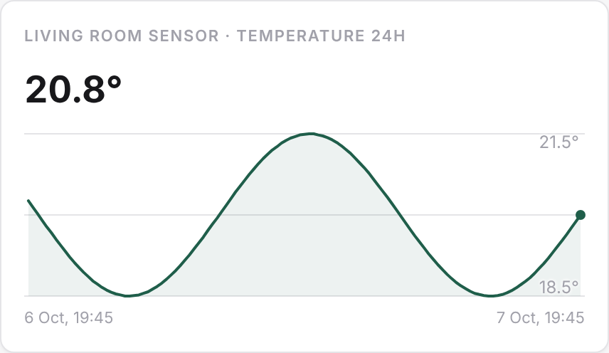

## `entity`

An entity's own row — its control or its readings — as a card.

```toml
{ kind = "entity", entity = "livingroom_lamp" }
```

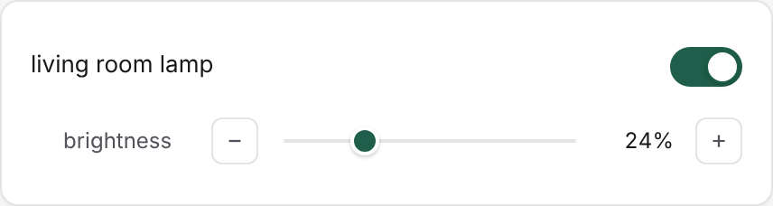

## `dial`

A thermostat dial: a temperature setpoint on an arc, the current reading beneath it.

```toml
{ kind = "dial", entity = "heat_pump" }
```

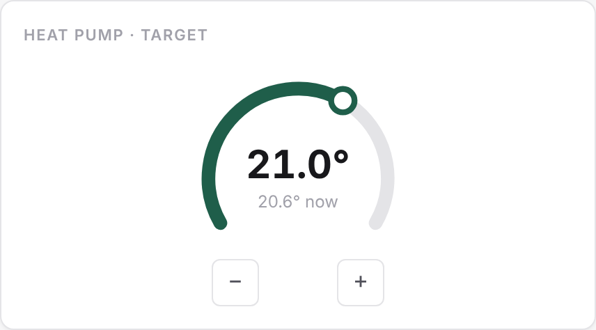

## `room`

A room's card: every entity in the room.

```toml
{ kind = "room", room = "livingroom" }
```

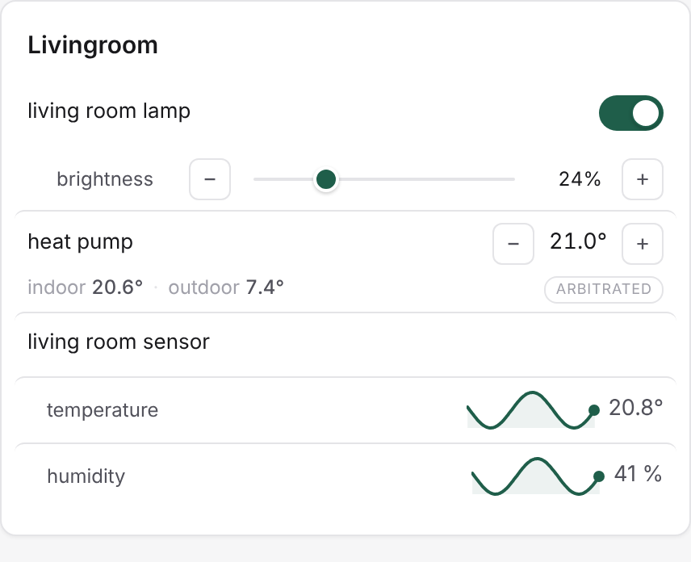

## `unit`

A unit's card: its family setpoints, the entities it publishes, the entities it drives (from the grant table) and the entities it reads (from its subscriptions) — a pure function of its manifest.

```toml
{ kind = "unit", unit = "evening_lights" }
```

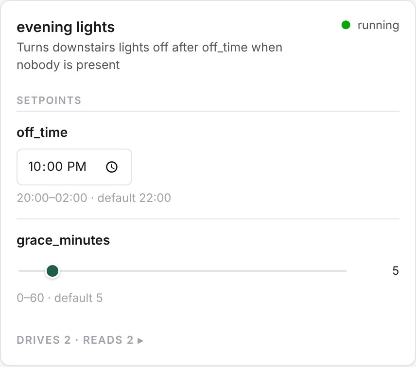

## `params`

A unit's family-editable parameters as one card.

```toml
{ kind = "params", unit = "evening_lights" }
```

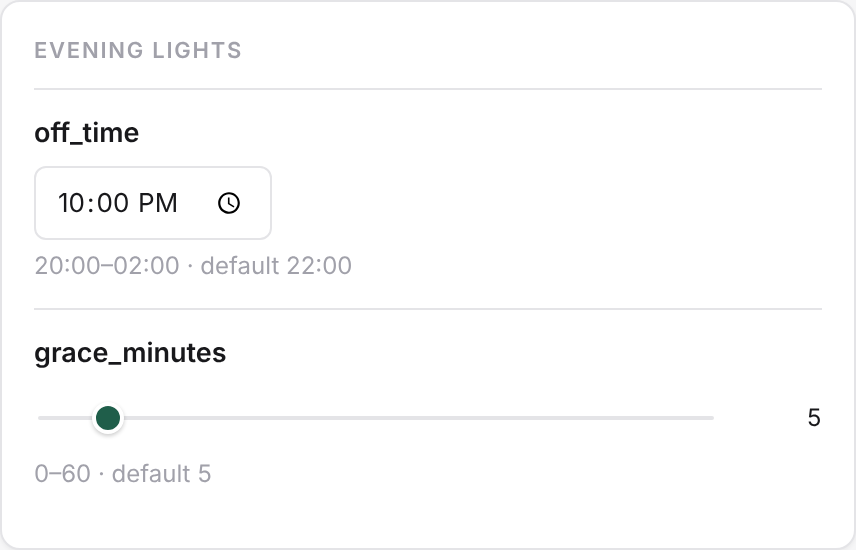

## `people`

The person entities, home or away.

```toml
{ kind = "people" }
```

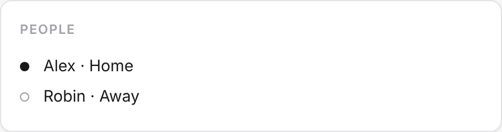

## `deviations`

The deviations feed: what is out of the ordinary.

```toml
{ kind = "deviations" }
```

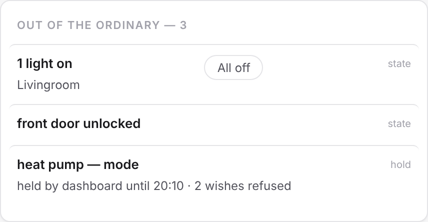

## `map`

The map over every entity with a location.

```toml
{ kind = "map" }
```

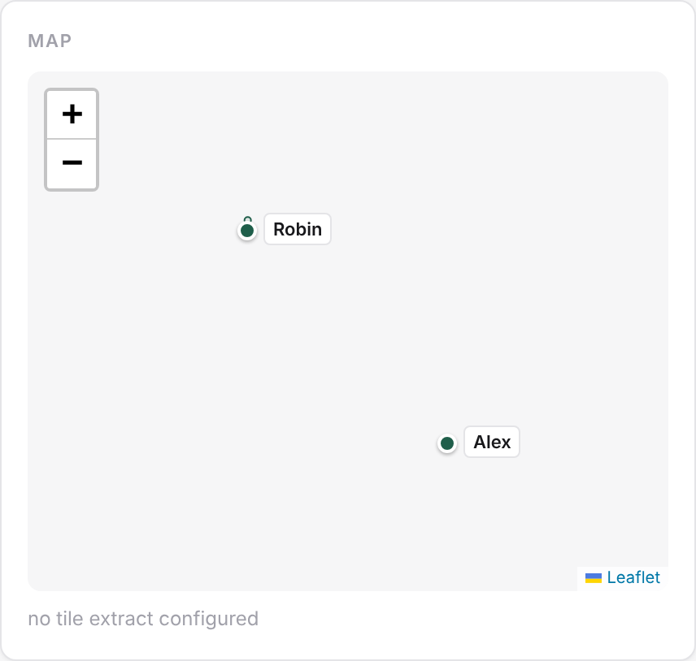

## `group`

Several widgets as one card — a dial with the traces that explain it, a setpoint beside what it drives. One level deep.

```toml
{ kind = "group", label = "Heating", widgets = [
  { kind = "dial", entity = "heat_pump" },
  { kind = "chart", entity = "livingroom_temp", aspect = "temperature", hours = 24 },
] }
```

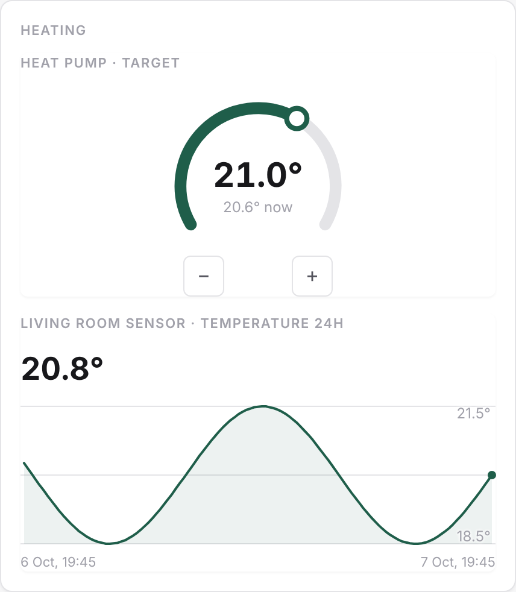

## `burner`

A burner's card: its two commands and the two temperatures an interlock reads — the `burner` vocabulary, nothing dialectal.

```toml
{ kind = "burner", entity = "stove" }
```

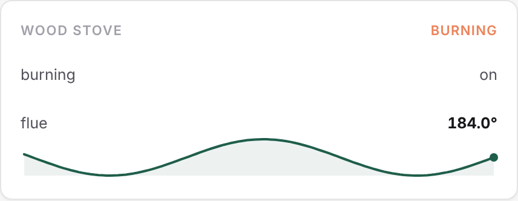
